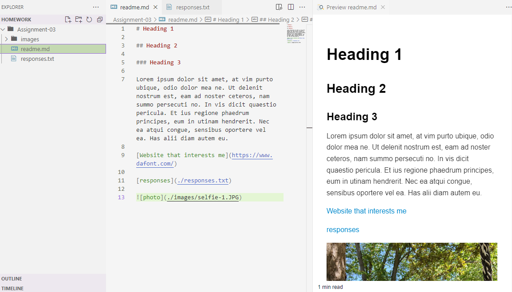

# Week 3 work process

## Summarizing the work I did this cycle, paying particular attention to the individual choices I made.

I started off this week by watching and reading the content on the external course website. I took some notes on the "the internet," for the quiz. Then I downloaded **Visual Studio Code** so that I can start on the tutorials. I had run through all the tutorials, which is why I'm now here working on my repo. So I can upload my VS Code directory in Github and complete assignment 3. Its backwards than what the assignment 3 tasks askes me to do, but I just followed the website VS code tutorials first than doing the github readme. After I'm done with this I'll move on and complete the *discussion post* and *quiz 3*.

Things left for me to do after assignment 3
  1. Discussion post
  2. reply to **two** classmates under discussion post
  3. quiz 3

[Week 3 website](https://montana-media-arts.github.io/webDesignFall2024/topic-02/overview/)

